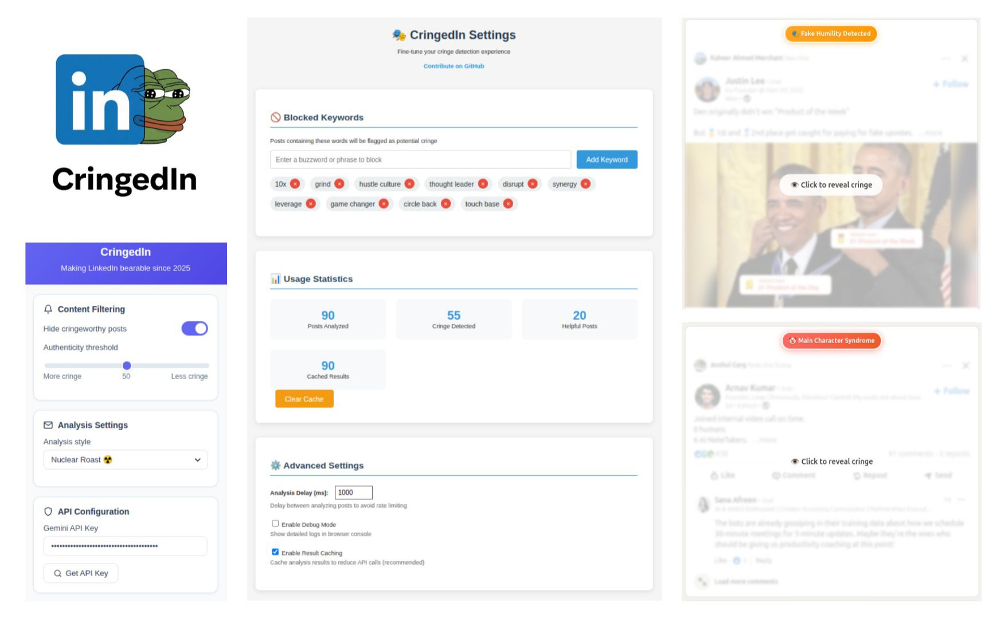

# CringedIn - LinkedIn Cringe Detector

A Chrome Extension that scans your LinkedIn feed, analyzes post tone using AI, and labels them with helpful or cringe badges.

## Features

- 🤖 Detects post tone: Hustle Bro, Fake Humility, Main Character Syndrome, etc.
- ✅ Adds visible badges to each post
- 👁️ Optionally blurs low-authenticity posts
- ⚙️ Customizable settings (authenticity threshold, hide cringe toggle)

## Setup

1. Clone the repo
2. Go to `chrome://extensions/`
3. Enable **Developer Mode**
4. Click **Load unpacked** and select the extension folder
5. Click on **Extensions > CringedIn > Input Your Gemini API Key**

## Screenshot

